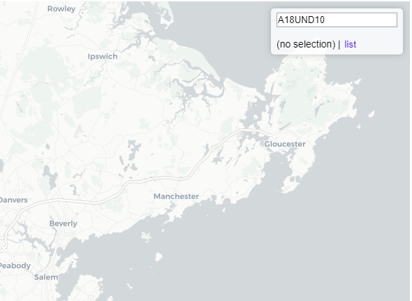

# longitudinal-census

A visualization of the longitudinal census data accompanying the paper:

Logan, John R., Zengwang Xu, and Brian J. Stults. 2014. "Interpolating US Decennial Census Tract Data from as Early as 1970 to 2010: A Longitudinal Tract Database" The Professional Geographer 66(3): 412–420.

[Live version](https://htmlpreview.github.io/?https://github.com/haben-michael/longitudinal-census/blob/master/census.html)

## USAGE
A statistic using census variable names may be input in the upper right form. The left/right arrow keys advance the map through the decades. Left clicking on a tract plots the statistic over the 4 decennial census data periods included (1970-2010).

## TODO
  * choice of color gradient--need diverging for neg/pos values
  * show some examples
  * maybe change shift-drag outline style
  * drop down list of available cities/regions to cycle through

## EXAMPLES (TODO)
1. *Basic choropleth.* Suppose we are interested in the number of individuals under age 18 in each Boston area census tract as measured in the most recent decennial census, 2010. The census variable is "A18UND10." By entering this variable in the formula box at the upper right a choropleth is generated for this variable.

    Pressing the `list` icon calls up a full list of available census variables.

2. *Longitudinal measurement.* To get a longitudinal view of the number of individuals under 18, enter "A18UNDYY" in the formula box, replacing the year indicator with "YY." Doing so loads  "A18UND80," "A18UND90," "A18UND00," and "A18UND10," i.e., the variable as measured in the 1980, 1990, 2000, or 2010 censuses. The left and right arrow keys cycle through the years, with a timeline at the bottom of map.

 Clicking on a census tract generates a plot of the variable over the available time period.

3. *Derived expressions.* For some purposes, not the number but proportional of individuals under 18 in each census tract may be the relevant measure. The proportion is the ratio of two census variables, "A18UNDYY" and "POPYY." The formula box accepts simple expressions of this type:

In fact, the formula box will execute the expression as javascript in an environment with the census variables available. So to generate a choropleth on the log scale, use:

4. *Multiple regions.* In order to select several tracts, hold shift while clicking on each. Select all tracts within a square region by holding down shift while dragging with the mouse.

The figure plotted is obtained by summing the census statistics for each of the select tracts.

As a result, the plot is usually only meaningful for census count variables.
